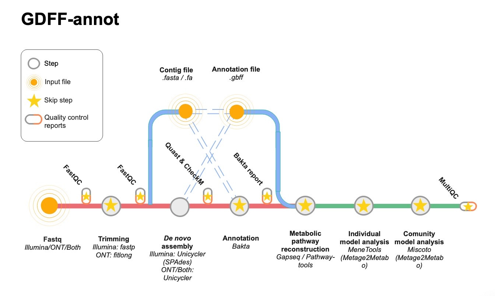

# Gdff Annot

Genomic data analysis pipeline for the reconstruction of the metabolic potential of bacteria suspected of playing a role in fermentation.

 

 

## Installation
### From source:

    git clone git@forgemia.inra.fr:migale/gdff-annot.git

The launchers are in the bin of the cloned repo.

### Conda:

    conda create -n {name.env}
    git clone git@forgemia.inra.fr:migale/gdff-annot.git
    cp -r gdff-annot/* path/to/env/{name.env}

Make sure you have sufficient rights to run both executables.

## Usage

There are two launchers in the bin of the cloned repo: gdff-annot.sh and generate_multi_species_config.sh.

- generate_multi_species_config : launches on the inputs folder. This script generates a correctly formatted configuration file where you can add the genus, species, taxon and protein fasta information (example: example_dataset/config_example_species.txt) for the annotation if they are different between the files (otherwise use the pipeline parameters directly). The input folder should be set as the first parameter and the configuration file name as the second parameter. The path to this configuration file should be supplied to the pipeline using the --multi-species parameter.
- gdff-annot : to launch the pipeline.

Launch the pipeline locally:

    conda activate {name.env}
    gdff-annot.sh --local --data_folder <data_folder> --results_folder <results_folder> --tmp_dir <tmp_folder> <options>
    
Launch the pipeline on the Migale cluster:

    conda activate {name.env}
    gdff-annot.sh --cluster --data_folder <data_folder> --results_folder <results_folder> --tmp_dir <tmp_folder> <options>

If the pipeline is launched on the cluster with a metabolic pathway reconstruction using gapseq, the jobs must be redirected to the bigmem.q queue in order to finish at 100%:

    qalter {job id} -q bigmem.q

## Inputs
Files must be in fastq.gz, fasta or gbff format. They must be stored in one data folder. 
Fastq files with the same names containing 1 and 2 will be analysed as paired-end illumina data. Otherwise, single-end files are considered as long reads. Paired-end and single-end files with the same prefix will be processed in hybrid mode.
If a fasta and gbff format are provided and have the same prefix, then the fasta annotation will be skipped and the pipeline will use the annotation provided.

GDFF-annot will start the pipeline in the appropriate step, depending on the file extension.

NB : Pathway-tools does not accept file names containing a . or /. If one of these signs exists in the prefix, please correct it otherwise this step will not be performed.

## Parameters
Main arguments:

    --local / --cluster     <mandatory first parameter> Choose whether to run the analysis locally or on the Migale cluster.
                            If you choose to run the analysis locally, activate the Snakemake environment first.
    --data_folder           <mandatory> Path to a folder containing fastq data.
                            Example: 'data'
    --results_folder        <mandatory> Results folder.
                            Example: 'results'
    --tmp_dir               <mandatory> Temporary files folder.
                            Example: 'results/tmp'

For more information on the existing parameters, please display the help message :

    gdff-annot.sh --help

## Dependencies

The tools on which GDFF-annot is based are :

- fastp v0.23.1
- filtlong v0.2.1
- unicycler v0.4.8
- bakta v1.7.0
- fastqc v0.11.9
- quast v5.2.0
- checkm-genome v1.1.3
- multiqc v1.12
- gapseq
- metage2metabo v1.5.4

You can change their version directly by modifying the config.yaml file in the cloned repo, changing the value of the tool you want to the name of your conda environment.
All the rules run on dependencies already installed on Migale. However, users must install gapseq or pathway-tools themselves.